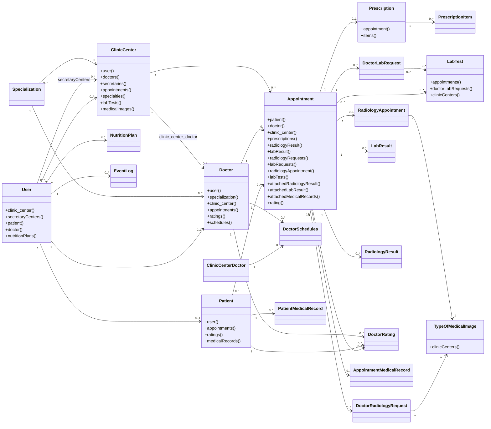

# Tabibi Database UML Reference

This document describes the current database schema and Eloquent relationship model for the Tabibi Laravel app. It is intended as a source reference for ERD, UML class diagrams, and database documentation.

Generated from:

- `database/migrations`
- `app/Models`
- A temporary SQLite migration run used to verify the final column set and foreign keys

## High-Level Domains

- Identity and access: `users`, `patients`, `doctors`, Spatie roles/permissions, Sanctum tokens, OTPs.
- Clinic network: `clinic_centers`, doctor-center assignments, center services, secretaries, pharmacists.
- Appointments and care workflow: `appointments`, prescriptions, ratings, lab/radiology requests and results.
- Medical catalog: `specializations`, lab tests, radiology image types.
- AI and nutrition: AI feature limits/usages and generated nutrition plans.
- Operations: notifications, event logs, queues, sessions, cache, password reset tokens.

## Important Schema Notes

These names/relationships are currently in the codebase and should be reflected exactly if you want diagrams to match the real schema:

- `promots` appears to mean promotions.
- `appointments.patient_id` is nullable for temporary/walk-in patients. Temporary patient data is stored on the appointment row.
- `appointment_medical_records.record_source` + `record_id` is an application-level polymorphic reference. There is no database FK from `record_id`.
- `notifications.notifiable_type` + `notifiable_id` and `personal_access_tokens.tokenable_type` + `tokenable_id` are Laravel polymorphic references.
- Spatie permission tables use polymorphic columns for model roles/permissions.
- `patients.profile_image` was added then removed; the `Patient` model still lists it in `$fillable`, but the final table does not contain it.
- `DoctorSchedules::doctor()` is missing a `return` statement in the model, although `doctor_schedules.doctor_id` exists as an FK.

## Main ERD Mermaid

```mermaid
erDiagram
    users ||--o| patients : owns_profile
    users ||--o| doctors : owns_profile
    users ||--o{ clinic_centers : admin_account
    users ||--o{ nutrition_plans : creates
    users ||--o{ event_logs : actor
    users ||--o{ clinic_center_secretaries : secretary
    users ||--o{ clinic_center_pharmacists : pharmacist

    specializations ||--o{ doctors : classifies
    specializations ||--o{ center_specialization : offered_at

    clinic_centers ||--o{ clinic_center_doctor : employs
    doctors ||--o{ clinic_center_doctor : works_at
    clinic_center_doctor ||--o{ doctor_schedules : schedules
    doctors ||--o{ doctor_schedules : has

    clinic_centers ||--o{ appointments : hosts
    doctors ||--o{ appointments : attends
    patients ||--o{ appointments : books

    appointments ||--o| prescriptions : has
    prescriptions ||--o{ prescription_items : contains
    appointments ||--o{ appointment_lab_tests : orders
    lab_tests ||--o{ appointment_lab_tests : included

    appointments ||--o{ doctor_lab_requests : requests
    doctor_lab_requests ||--o{ doctor_lab_request_tests : includes
    lab_tests ||--o{ doctor_lab_request_tests : selected
    appointments ||--o{ lab_results : produces

    appointments ||--o{ doctor_radiology_requests : requests
    type_of_medical_images ||--o{ doctor_radiology_requests : selected
    appointments ||--o| radiology_appointments : schedules
    type_of_medical_images ||--o{ radiology_appointments : type
    appointments ||--o{ radiology_results : produces

    appointments ||--o| doctor_ratings : rating
    doctors ||--o{ doctor_ratings : receives
    patients ||--o{ doctor_ratings : gives

    patients ||--o{ patient_medical_records : owns
    appointments ||--o{ appointment_medical_records : attaches

    clinic_centers ||--o{ clinic_center_lab_tests : prices
    lab_tests ||--o{ clinic_center_lab_tests : priced_at
    clinic_centers ||--o{ clinic_center_medical_images : prices
    type_of_medical_images ||--o{ clinic_center_medical_images : priced_at

    patients ||--o{ ai_feature_usages : consumes
```

## Table Reference

### Identity and User Tables

#### `users`

Purpose: Base account table for all roles: patient, doctor, clinic admin, super admin, secretary, pharmacist.

Columns:

- `id` PK
- `name`
- `email` nullable, unique
- `email_verified_at` nullable
- `password`
- `remember_token` nullable
- `phone` nullable, unique
- `profile_image` nullable
- `fcm_token` nullable text
- `last_name` nullable
- `created_at`, `updated_at`

Relations:

- `users.id` 1:1 `patients.user_id`
- `users.id` 1:1 `doctors.user_id`
- `users.id` 1:N `clinic_centers.user_id`
- `users.id` 1:N `nutrition_plans.user_id`
- `users.id` 1:N `event_logs.user_id`
- `users.id` M:N `clinic_centers.id` through `clinic_center_secretaries`
- `users.id` M:N `clinic_centers.id` through `clinic_center_pharmacists`
- Polymorphic M:N roles/permissions through Spatie tables.
- Polymorphic 1:N Sanctum tokens through `personal_access_tokens`.
- Polymorphic 1:N notifications through `notifications`.

Eloquent:

- `User::patient()` hasOne `Patient`
- `User::doctor()` hasOne `Doctor`
- `User::clinic_center()` hasOne `ClinicCenter`
- `User::secretaryCenters()` belongsToMany `ClinicCenter`
- `User::nutritionPlans()` hasMany `NutritionPlan`
- `HasRoles`, `HasApiTokens`, `Notifiable`

#### `patients`

Purpose: Medical profile for a user with patient role.

Columns:

- `id` PK
- `user_id` FK unique -> `users.id`, cascade delete/update
- `gender`
- `weight` nullable
- `height` nullable
- `marital_status`
- `has_children` boolean default false
- `number_of_children` nullable
- `address` text
- `is_smoke` boolean default false
- `birth_date` date
- `chronic_diseases` nullable text
- `permanent_medications` nullable text
- `favorite_foods` nullable text
- `disliked_foods` nullable text
- `food_allergies` nullable text
- `blood_type` nullable enum-like string: `O+`, `O-`, `A+`, `A-`, `B+`, `B-`, `AB+`, `AB-`
- `digestion_issues` nullable
- `created_at`, `updated_at`

Relations:

- Belongs to `users`
- Has many `appointments`
- Has many `doctor_ratings`
- Has many `patient_medical_records`
- Has many `ai_feature_usages`

Eloquent:

- `Patient::user()` belongsTo `User`
- `Patient::appointments()` hasMany `Appointment`
- `Patient::ratings()` hasMany `DoctorRating`
- `Patient::medicalRecords()` hasMany `PatientMedicalRecord`

#### `doctors`

Purpose: Doctor/provider profile for a user. `doctor_type` separates normal doctors, radiology doctors, and lab doctors.

Columns:

- `id` PK
- `user_id` FK unique -> `users.id`, cascade delete/update
- `specialization_id` nullable FK -> `specializations.id`, cascade delete/update
- `doctor_type` enum-like string default `doctor`: `doctor`, `radiology`, `lab`
- `bio` nullable text
- `is_active` boolean default true
- `profile_image` nullable
- `experience_years`
- `created_at`, `updated_at`

Relations:

- Belongs to `users`
- Belongs to `specializations`
- M:N with `clinic_centers` through `clinic_center_doctor`
- Has many `appointments`
- Has many `doctor_ratings`
- Has many `doctor_schedules`

Eloquent:

- `Doctor::user()` belongsTo `User`
- `Doctor::specialization()` belongsTo `Specialization`
- `Doctor::clinic_center()` belongsToMany `ClinicCenter` with pivot `price`, `appointment_duration_minutes`
- `Doctor::appointments()` hasMany `Appointment`
- `Doctor::ratings()` hasMany `DoctorRating`
- `Doctor::schedules()` hasMany `DoctorSchedules`

### Clinic and Scheduling Tables

#### `clinic_centers`

Purpose: Clinic center/hospital/location entity. Owned by a user account, usually admin.

Columns:

- `id` PK
- `user_id` FK -> `users.id`, cascade delete/update
- `name`
- `address`
- `is_active` boolean default true
- `bio` nullable text
- `created_at`, `updated_at`

Relations:

- Belongs to `users`
- M:N with `doctors` through `clinic_center_doctor`
- M:N with `specializations` through `center_specialization`
- M:N with `lab_tests` through `clinic_center_lab_tests`
- M:N with `type_of_medical_images` through `clinic_center_medical_images`
- M:N with `users` through `clinic_center_secretaries`
- M:N with `users` through `clinic_center_pharmacists`
- Has many `appointments`

Eloquent:

- `ClinicCenter::user()` belongsTo `User`
- `ClinicCenter::doctors()` belongsToMany `Doctor`
- `ClinicCenter::secretaries()` belongsToMany `User`
- `ClinicCenter::appointments()` hasMany `Appointment`
- `ClinicCenter::specialties()` belongsToMany `Specialization`
- `ClinicCenter::labTests()` belongsToMany `LabTest`
- `ClinicCenter::medicalImages()` belongsToMany `TypeOfMedicalImage`

#### `clinic_center_doctor`

Purpose: Pivot table assigning doctors to centers and storing center-specific appointment price/duration.

Columns:

- `id` PK
- `clinic_center_id` FK -> `clinic_centers.id`, cascade delete/update
- `doctor_id` FK -> `doctors.id`, cascade delete/update
- `price` decimal/numeric
- `appointment_duration_minutes` unsigned small int default 30
- `created_at`, `updated_at`

Constraints:

- Unique: `clinic_center_id`, `doctor_id`

Relations:

- Belongs to `clinic_centers`
- Belongs to `doctors`
- Has many `doctor_schedules`

Eloquent:

- `ClinicCenterDoctor::doctor()` belongsTo `Doctor`
- `ClinicCenterDoctor::clinic_center()` belongsTo `ClinicCenter`
- `ClinicCenterDoctor::schedules()` hasMany `DoctorSchedules`

#### `doctor_schedules`

Purpose: Doctor working schedule at a clinic center assignment.

Columns:

- `id` PK
- `clinic_center_doctor_id` FK -> `clinic_center_doctor.id`, cascade delete/update
- `doctor_id` FK -> `doctors.id`, cascade delete/update
- `day_of_week` unsigned tiny int
- `start_time`
- `end_time`
- `created_at`, `updated_at`

Relations:

- Belongs to `clinic_center_doctor`
- Belongs to `doctors`

Eloquent:

- `DoctorSchedules::clinicCenterDoctor()` belongsTo `ClinicCenterDoctor`
- `DoctorSchedules::doctor()` intended belongsTo `Doctor`, but currently missing `return`

#### `center_specialization`

Purpose: Pivot table for which specializations are offered by a clinic center.

Columns:

- `id` PK
- `clinic_center_id` FK -> `clinic_centers.id`, cascade delete/update
- `specialization_id` FK -> `specializations.id`, cascade delete/update
- `created_at`, `updated_at`

Relations:

- `clinic_centers` M:N `specializations`

#### `clinic_center_secretaries`

Purpose: Assigns secretary user accounts to clinic centers.

Columns:

- `id` PK
- `clinic_center_id` FK -> `clinic_centers.id`, cascade delete
- `user_id` FK unique -> `users.id`, cascade delete
- `created_at`, `updated_at`

Relations:

- `clinic_centers` M:N `users`
- User can be secretary for only one center because `user_id` is unique.

#### `clinic_center_pharmacists`

Purpose: Assigns pharmacist user accounts to clinic centers.

Columns:

- `id` PK
- `clinic_center_id` FK -> `clinic_centers.id`, cascade delete
- `user_id` FK -> `users.id`, cascade delete
- `created_at`, `updated_at`

Relations:

- `clinic_centers` M:N `users`

### Medical Catalog Tables

#### `specializations`

Purpose: Medical specialization taxonomy.

Columns:

- `id` PK
- `name`
- `image` nullable
- `created_at`, `updated_at`

Relations:

- Has many `doctors`
- M:N with `clinic_centers` through `center_specialization`

Eloquent:

- `Specialization::doctors()` hasMany `Doctor`
- `Specialization::centers()` belongsToMany `ClinicCenter`

### Appointment and Care Workflow Tables

#### `appointments`

Purpose: Central appointment record for doctor, lab, and radiology workflows.

Columns:

- `id` PK
- `patient_id` nullable FK -> `patients.id`, null on delete, cascade update
- `temp_patient_name` nullable
- `temp_patient_phone` nullable
- `temp_patient_gender` nullable enum-like string: `male`, `female`
- `temp_patient_age` nullable unsigned tiny int
- `doctor_id` FK -> `doctors.id`, cascade delete/update
- `clinic_center_id` FK -> `clinic_centers.id`, cascade delete/update
- `type` enum-like string default `doctor`: `doctor`, `radiology`, `lab`
- `start_at` datetime
- `end_at` nullable datetime
- `status` enum-like string default `pending`: `pending`, `canceled`, `completed`
- `score` nullable float
- `emergency` boolean default false
- `note` nullable text
- `result_ratio` nullable float
- `expected_disease` nullable string
- `is_risk` nullable boolean
- `doctor_note` nullable text
- `attached_radiology_result_id` nullable FK -> `radiology_results.id`, null on delete
- `attached_lab_result_id` nullable FK -> `lab_results.id`, null on delete
- `price` decimal default 0
- `created_at`, `updated_at`

Relations:

- Belongs to `patients` optionally
- Belongs to `doctors`
- Belongs to `clinic_centers`
- Has one `prescriptions`
- Has one/many `radiology_results` depending on workflow; model says hasOne
- Has one/many `lab_results`; model says hasOne
- Has many `doctor_radiology_requests`
- Has many `doctor_lab_requests`
- Has one `radiology_appointments`
- M:N with `lab_tests` through `appointment_lab_tests`
- Belongs to attached `radiology_results` and `lab_results`
- Has many `appointment_medical_records`
- Has one `doctor_ratings`

Eloquent:

- `Appointment::patient()` belongsTo `Patient`
- `Appointment::doctor()` belongsTo `Doctor`
- `Appointment::clinic_center()` belongsTo `ClinicCenter`
- `Appointment::prescriptions()` hasOne `Prescription`
- `Appointment::radiologyResult()` hasOne `RadiologyResult`
- `Appointment::labResult()` hasOne `LabResult`
- `Appointment::radiologyRequests()` hasMany `DoctorRadiologyRequest`
- `Appointment::labRequests()` hasMany `DoctorLabRequest`
- `Appointment::radiologyAppointment()` hasOne `RadiologyAppointment`
- `Appointment::labTests()` belongsToMany `LabTest`
- `Appointment::attachedRadiologyResult()` belongsTo `RadiologyResult`
- `Appointment::attachedLabResult()` belongsTo `LabResult`
- `Appointment::attachedMedicalRecords()` hasMany `AppointmentMedicalRecord`
- `Appointment::rating()` hasOne `DoctorRating`

#### `doctor_ratings`

Purpose: Patient rating/comment for a doctor after an appointment.

Columns:

- `id` PK
- `appointment_id` nullable FK unique -> `appointments.id`, cascade delete
- `doctor_id` FK -> `doctors.id`, cascade delete
- `patient_id` FK -> `patients.id`, cascade delete
- `rating` unsigned tiny int
- `comment` nullable text
- `created_at`, `updated_at`

Constraints:

- Unique: `appointment_id`
- Unique: `doctor_id`, `patient_id`

Relations:

- Belongs to `appointments`
- Belongs to `doctors`
- Belongs to `patients`

#### `prescriptions`

Purpose: Prescription header attached to an appointment.

Columns:

- `id` PK
- `appointment_id` FK -> `appointments.id`, cascade delete
- `prescriptions_note` nullable text
- `general_note` nullable text
- `status` enum-like string default `pending`: `pending`, `ready`, `dispensed`
- `send_to_pharmacy` boolean default false
- `pharmacy_status` string default `not_sent`
- `created_at`, `updated_at`

Relations:

- Belongs to `appointments`
- Has many `prescription_items`

Eloquent:

- `Prescription::appointment()` belongsTo `Appointment`
- `Prescription::items()` hasMany `PrescriptionItem`

#### `prescription_items`

Purpose: Medicine line items for a prescription.

Columns:

- `id` PK
- `prescription_id` FK -> `prescriptions.id`, cascade delete
- `medicine_name`
- `dose`
- `frequency`
- `start_date` date
- `end_date` date
- `instructions` nullable text
- `created_at`, `updated_at`

Relations:

- Belongs to `prescriptions`

### Lab Workflow Tables

#### `lab_tests`

Purpose: Lab test catalog.

Columns:

- `id` PK
- `name`
- `created_at`, `updated_at`

Relations:

- M:N with `appointments` through `appointment_lab_tests`
- M:N with `doctor_lab_requests` through `doctor_lab_request_tests`
- M:N with `clinic_centers` through `clinic_center_lab_tests`

#### `appointment_lab_tests`

Purpose: Lab tests selected for a lab appointment.

Columns:

- `id` PK
- `appointment_id` FK -> `appointments.id`, cascade delete
- `lab_test_id` FK -> `lab_tests.id`, cascade delete
- `created_at`, `updated_at`

Relations:

- `appointments` M:N `lab_tests`

#### `doctor_lab_requests`

Purpose: Lab request order created by a doctor for an appointment.

Columns:

- `id` PK
- `appointment_id` FK -> `appointments.id`, cascade delete
- `notes` nullable text
- `created_at`, `updated_at`

Relations:

- Belongs to `appointments`
- M:N with `lab_tests` through `doctor_lab_request_tests`

#### `doctor_lab_request_tests`

Purpose: Pivot table for tests included in a doctor lab request.

Columns:

- `id` PK
- `doctor_lab_request_id` FK -> `doctor_lab_requests.id`, cascade delete
- `lab_test_id` FK -> `lab_tests.id`, cascade delete
- `created_at`, `updated_at`

Relations:

- `doctor_lab_requests` M:N `lab_tests`

#### `lab_results`

Purpose: Uploaded lab result and AI diagnosis for an appointment.

Columns:

- `id` PK
- `appointment_id` FK -> `appointments.id`, cascade delete
- `result_file`
- `notes` nullable text
- `ai_diagnosis` nullable text
- `created_at`, `updated_at`

Relations:

- Belongs to `appointments`
- Can be attached back to `appointments.attached_lab_result_id`
- Can be referenced by `appointment_medical_records` when `record_source = lab_result`

### Radiology Workflow Tables

#### `type_of_medical_images`

Purpose: Radiology/image type catalog.

Columns:

- `id` PK
- `name`
- `created_at`, `updated_at`

Relations:

- Has many `medical_images`
- Has many `radiology_appointments`
- Has many `doctor_radiology_requests`
- M:N with `clinic_centers` through `clinic_center_medical_images`

#### `medical_images`

Purpose: Minimal table linking to medical image type. It currently has no file path column.

Columns:

- `id` PK
- `type_of_medical_image_id` FK -> `type_of_medical_images.id`, cascade delete/update
- `created_at`, `updated_at`

Relations:

- Belongs to `type_of_medical_images`

#### `radiology_appointments`

Purpose: Radiology appointment details for an appointment.

Columns:

- `id` PK
- `appointment_id` FK -> `appointments.id`, cascade delete
- `type_of_medical_image_id` FK -> `type_of_medical_images.id`, cascade delete
- `created_at`, `updated_at`

Relations:

- Belongs to `appointments`
- Belongs to `type_of_medical_images`

#### `doctor_radiology_requests`

Purpose: Radiology request order created by a doctor for an appointment.

Columns:

- `id` PK
- `appointment_id` FK -> `appointments.id`, cascade delete
- `type_of_medical_image_id` FK -> `type_of_medical_images.id`, cascade delete
- `notes` nullable text
- `created_at`, `updated_at`

Relations:

- Belongs to `appointments`
- Belongs to `type_of_medical_images`

#### `radiology_results`

Purpose: Uploaded radiology result and AI diagnosis.

Columns:

- `id` PK
- `appointment_id` FK -> `appointments.id`, cascade delete
- `image_path`
- `notes` nullable text
- `ai_diagnosis` nullable text
- `created_at`, `updated_at`

Relations:

- Belongs to `appointments`
- Can be attached back to `appointments.attached_radiology_result_id`
- Can be referenced by `appointment_medical_records` when `record_source = radiology_result`

### Center Service Pricing Tables

#### `clinic_center_lab_tests`

Purpose: Which lab tests a center offers and at what price.

Columns:

- `id` PK
- `clinic_center_id` FK -> `clinic_centers.id`, cascade delete
- `lab_test_id` FK -> `lab_tests.id`, cascade delete
- `price` decimal(8,2)
- `created_at`, `updated_at`

Constraints:

- Unique: `clinic_center_id`, `lab_test_id`

Relations:

- `clinic_centers` M:N `lab_tests`

#### `clinic_center_medical_images`

Purpose: Which radiology services a center offers and at what price.

Columns:

- `id` PK
- `clinic_center_id` FK -> `clinic_centers.id`, cascade delete
- `type_of_medical_image_id` FK -> `type_of_medical_images.id`, cascade delete
- `price` decimal(8,2)
- `created_at`, `updated_at`

Constraints:

- Unique: `clinic_center_id`, `type_of_medical_image_id`

Relations:

- `clinic_centers` M:N `type_of_medical_images`

### Medical Records Tables

#### `patient_medical_records`

Purpose: Patient-uploaded historical lab/radiology medical records.

Columns:

- `id` PK
- `patient_id` FK -> `patients.id`, cascade delete
- `type` enum-like string: `lab`, `radiology`
- `title`
- `record_date` date
- `file_path`
- `created_at`, `updated_at`

Relations:

- Belongs to `patients`
- Can be referenced by `appointment_medical_records` when `record_source = patient_medical_record`

#### `appointment_medical_records`

Purpose: Links an appointment to attached records from multiple sources.

Columns:

- `id` PK
- `appointment_id` FK -> `appointments.id`, cascade delete
- `record_source` enum-like string: `lab_result`, `radiology_result`, `patient_medical_record`
- `record_id` unsigned bigint, no database FK
- `created_at`, `updated_at`

Relations:

- Belongs to `appointments`
- App-level polymorphic target:
  - `record_source = lab_result` -> `lab_results.id`
  - `record_source = radiology_result` -> `radiology_results.id`
  - `record_source = patient_medical_record` -> `patient_medical_records.id`

### AI and Nutrition Tables

#### `nutrition_plans`

Purpose: AI-generated or user-associated nutrition plan.

Columns:

- `id` PK
- `user_id` FK -> `users.id`, cascade delete
- `diet_type` nullable
- `macros` nullable JSON/text
- `goal_note` nullable text
- `generation_inputs` nullable JSON/text
- `summary` nullable text
- `daily_calories_target` nullable unsigned int
- `daily_water_liters` nullable decimal(5,2)
- `week_plan` nullable JSON/text
- `saturday_plan` nullable JSON/text
- `sunday_plan` nullable JSON/text
- `monday_plan` nullable JSON/text
- `tuesday_plan` nullable JSON/text
- `wednesday_plan` nullable JSON/text
- `thursday_plan` nullable JSON/text
- `friday_plan` nullable JSON/text
- `created_at`, `updated_at`

Relations:

- Belongs to `users`

Eloquent:

- Casts plan JSON fields to arrays
- `NutritionPlan::user()` belongsTo `User`

#### `ai_feature_usages`

Purpose: Tracks patient AI feature usage for a period.

Columns:

- `id` PK
- `patient_id` FK -> `patients.id`, cascade delete
- `feature_type` string
- `used_count` unsigned int default 0
- `period_start` datetime
- `period_end` datetime
- `created_at`, `updated_at`

Relations:

- Belongs to `patients`

#### `ai_feature_limits`

Purpose: Configures limit per AI feature.

Columns:

- `id` PK
- `feature_type` unique string
- `limit` unsigned int default 0
- `period` enum-like string default `week`: `day`, `week`, `month`
- `created_at`, `updated_at`

Relations:

- No explicit FK. Join logically to `ai_feature_usages.feature_type` by string.

### Operational Tables

#### `promots`

Purpose: Promotional/health tip content.

Columns:

- `id` PK
- `information` text
- `image` nullable
- `created_at`, `updated_at`

Relations:

- No FKs.

#### `notifications`

Purpose: Laravel database notification table.

Columns:

- `id` UUID PK
- `type`
- `notifiable_type`
- `notifiable_id`
- `data` text
- `read_at` nullable
- `created_at`, `updated_at`

Relations:

- Polymorphic to notifiable models. In this app, commonly `users`.

#### `event_logs`

Purpose: Audit/event log for model add/delete activity.

Columns:

- `id` PK
- `user_id` nullable FK -> `users.id`, null on delete
- `user_name` nullable
- `user_role` nullable
- `table_name`
- `model_type` nullable
- `model_id` nullable
- `status` enum-like string: `add`, `delete`
- `message` text
- `parameters` nullable JSON/text
- `ip_address` nullable
- `user_agent` nullable text
- `created_at`, `updated_at`

Indexes:

- `table_name`
- `model_id`
- `table_name`, `status`
- `user_id`, `created_at`

Relations:

- Belongs to `users` as actor
- `model_type` + `model_id` is app-level reference to the affected Eloquent model.

### Auth, Role, Token, and Framework Tables

#### `roles`

Purpose: Spatie role lookup.

Columns:

- `id` PK
- `name`
- `guard_name`
- `created_at`, `updated_at`

Constraints:

- Unique: `name`, `guard_name`

Relations:

- M:N with permissions through `role_has_permissions`
- Polymorphic M:N with models through `model_has_roles`

#### `permissions`

Purpose: Spatie permission lookup.

Columns:

- `id` PK
- `name`
- `guard_name`
- `created_at`, `updated_at`

Constraints:

- Unique: `name`, `guard_name`

Relations:

- M:N with roles through `role_has_permissions`
- Polymorphic M:N with models through `model_has_permissions`

#### `model_has_roles`

Purpose: Polymorphic pivot assigning roles to models.

Columns:

- `role_id` FK -> `roles.id`, cascade delete
- `model_type`
- `model_id`

Primary key:

- `role_id`, `model_id`, `model_type`

Common relation:

- `users.id` maps where `model_type = App\Models\User`

#### `model_has_permissions`

Purpose: Polymorphic pivot assigning permissions directly to models.

Columns:

- `permission_id` FK -> `permissions.id`, cascade delete
- `model_type`
- `model_id`

Primary key:

- `permission_id`, `model_id`, `model_type`

#### `role_has_permissions`

Purpose: Pivot table between roles and permissions.

Columns:

- `permission_id` FK -> `permissions.id`, cascade delete
- `role_id` FK -> `roles.id`, cascade delete

Primary key:

- `permission_id`, `role_id`

#### `personal_access_tokens`

Purpose: Laravel Sanctum API tokens.

Columns:

- `id` PK
- `tokenable_type`
- `tokenable_id`
- `name` text
- `token` unique
- `abilities` nullable text
- `last_used_at` nullable
- `expires_at` nullable indexed
- `created_at`, `updated_at`

Relations:

- Polymorphic to tokenable models. In this app, commonly `users`.

#### `otps`

Purpose: OTP package table from `ichtrojan/laravel-otp`.

Columns:

- `id` PK
- `identifier`
- `token`
- `validity`
- `valid` boolean default true
- `created_at`, `updated_at`

Relations:

- No FK.

#### `password_reset_tokens`

Purpose: Laravel password reset token table.

Columns:

- `email` PK
- `token`
- `created_at` nullable

Relations:

- Logical relation to `users.email`, no FK.

#### `sessions`

Purpose: Laravel session storage.

Columns:

- `id` PK
- `user_id` nullable indexed
- `ip_address` nullable
- `user_agent` nullable text
- `payload` long text
- `last_activity` indexed int

Relations:

- Logical relation to `users.id`, no FK.

#### `cache`

Purpose: Laravel cache storage.

Columns:

- `key` PK
- `value` medium text
- `expiration` int

#### `cache_locks`

Purpose: Laravel atomic cache locks.

Columns:

- `key` PK
- `owner`
- `expiration` int

#### `jobs`

Purpose: Laravel queued jobs.

Columns:

- `id` PK
- `queue` indexed
- `payload` long text
- `attempts` unsigned tiny int
- `reserved_at` nullable unsigned int
- `available_at` unsigned int
- `created_at` unsigned int

#### `job_batches`

Purpose: Laravel batched queued jobs.

Columns:

- `id` PK
- `name`
- `total_jobs`
- `pending_jobs`
- `failed_jobs`
- `failed_job_ids` long text
- `options` nullable medium text
- `cancelled_at` nullable int
- `created_at` int
- `finished_at` nullable int

#### `failed_jobs`

Purpose: Laravel failed jobs.

Columns:

- `id` PK
- `uuid` unique
- `connection` text
- `queue` text
- `payload` long text
- `exception` long text
- `failed_at` timestamp current

#### `migrations`

Purpose: Laravel migration history.

Columns:

- `id` PK
- `migration`
- `batch`

## Eloquent Class Relationship Summary

Use this section for class diagrams. It describes class methods, not only DB FKs.

### Class Diagram Mermaid Starter

### `User`

- Has one `Patient`
- Has one `Doctor`
- Has one `ClinicCenter`
- Has many `NutritionPlan`
- Belongs to many `ClinicCenter` as secretary through `clinic_center_secretaries`
- Has many roles and permissions via Spatie `HasRoles`
- Has many personal access tokens via Sanctum `HasApiTokens`
- Has many notifications via Laravel `Notifiable`

### `Patient`

- Belongs to `User`
- Has many `Appointment`
- Has many `DoctorRating`
- Has many `PatientMedicalRecord`
- Database also has many `AiFeatureUsage`

### `Doctor`

- Belongs to `User`
- Belongs to `Specialization`
- Belongs to many `ClinicCenter` through `clinic_center_doctor`
- Has many `Appointment`
- Has many `DoctorRating`
- Has many `DoctorSchedules`

### `ClinicCenter`

- Belongs to `User`
- Belongs to many `Doctor`
- Belongs to many `User` as secretaries
- Has many `Appointment`
- Belongs to many `Specialization`
- Belongs to many `LabTest`
- Belongs to many `TypeOfMedicalImage`

### `Appointment`

- Belongs to `Patient`
- Belongs to `Doctor`
- Belongs to `ClinicCenter`
- Has one `Prescription`
- Has one `RadiologyResult`
- Has one `LabResult`
- Has many `DoctorRadiologyRequest`
- Has many `DoctorLabRequest`
- Has one `RadiologyAppointment`
- Belongs to many `LabTest`
- Belongs to attached `RadiologyResult`
- Belongs to attached `LabResult`
- Has many `AppointmentMedicalRecord`
- Has one `DoctorRating`

### `Prescription`

- Belongs to `Appointment`
- Has many `PrescriptionItem`

### `Lab/Radiology Classes`

- `LabTest` belongs to many `Appointment`, `DoctorLabRequest`, `ClinicCenter`
- `DoctorLabRequest` belongs to `Appointment`, belongs to many `LabTest`
- `LabResult` belongs to `Appointment`
- `TypeOfMedicalImage` belongs to many `ClinicCenter`
- `DoctorRadiologyRequest` belongs to `Appointment`, belongs to `TypeOfMedicalImage`
- `RadiologyAppointment` belongs to `Appointment`, belongs to `TypeOfMedicalImage`
- `RadiologyResult` belongs to `Appointment`
- `MedicalImage` has `type_of_medical_image_id` but no relationship method defined

## UML Drawing Guidance

For a clear class diagram, split the system into diagrams instead of drawing everything in one canvas:

1. Identity and roles:
   - `User`, `Patient`, `Doctor`, `ClinicCenter`, `Role`, `Permission`, `PersonalAccessToken`, `Notification`
2. Clinic operations:
   - `ClinicCenter`, `Doctor`, `ClinicCenterDoctor`, `DoctorSchedules`, `Specialization`, `ClinicCenterSecretaries`, `ClinicCenterPharmacists`
3. Appointments:
   - `Appointment`, `Prescription`, `PrescriptionItem`, `DoctorRating`
4. Lab/radiology:
   - `LabTest`, `DoctorLabRequest`, `LabResult`, `TypeOfMedicalImage`, `DoctorRadiologyRequest`, `RadiologyAppointment`, `RadiologyResult`
5. Medical records and AI:
   - `PatientMedicalRecord`, `AppointmentMedicalRecord`, `NutritionPlan`, `AiFeatureUsage`, `AiFeatureLimit`

## Relationship Cardinality Cheat Sheet

- User 1:1 Patient
- User 1:1 Doctor
- User 1:N ClinicCenter
- User M:N ClinicCenter as secretary
- User M:N ClinicCenter as pharmacist
- User M:N Role through Spatie polymorphic table
- ClinicCenter M:N Doctor through `clinic_center_doctor`
- ClinicCenter M:N Specialization through `center_specialization`
- ClinicCenter M:N LabTest through `clinic_center_lab_tests`
- ClinicCenter M:N TypeOfMedicalImage through `clinic_center_medical_images`
- Doctor 1:N Appointment
- Patient 1:N Appointment, but appointment patient can be null
- ClinicCenter 1:N Appointment
- Appointment 1:1 Prescription
- Prescription 1:N PrescriptionItem
- Appointment M:N LabTest
- Appointment 1:N DoctorLabRequest
- DoctorLabRequest M:N LabTest
- Appointment 1:N DoctorRadiologyRequest
- Appointment 1:1 RadiologyAppointment
- Appointment 1:N LabResult
- Appointment 1:N RadiologyResult
- Appointment 1:1 DoctorRating
- Patient 1:N PatientMedicalRecord
- Appointment 1:N AppointmentMedicalRecord
- Patient 1:N AiFeatureUsage
- User 1:N NutritionPlan
- User 1:N EventLog
