# Tabibi Use Case Diagram Reference

This document is a diagram-ready reference for creating the Use Case Diagram of the Tabibi Healthcare Management System.

Scope is based on the current Laravel routes/controllers and the stakeholder requirements document. Use cases that exist only as future requirements, but do not appear in the current route/controller surface, are listed separately as out of scope.

## System Boundary

System name:

- `Tabibi Healthcare Management System`

Main channels:

- Web dashboard for Super Admin, Center Admin, Secretary, Doctor, Lab Doctor, Radiology Doctor, and Pharmacist.
- Mobile/API channel for Patient and Doctor workflows.
- External service integration for AI workflows and push notifications.

## Actors

### Primary Human Actors

| Actor | Type | Description |
|---|---|---|
| Guest | Primary | Unauthenticated visitor/user who can register, log in, or request password reset. |
| Authenticated User | Abstract/general actor | Shared behavior for every logged-in user: logout, profile access, notification access, password reset after login, FCM token update. |
| Patient | Primary | Mobile/API user who books appointments, manages profile/records, rates doctors, uses AI and nutrition features. |
| Doctor | Abstract/general actor | Authenticated medical provider. Shared doctor behavior includes viewing appointments and appointment details. |
| General Doctor | Primary | Doctor who handles clinical appointments, writes notes, creates prescriptions, requests lab/radiology work, and cancels own appointments. |
| Lab Doctor | Primary | Doctor-type actor responsible for lab appointments and lab result completion. |
| Radiology Doctor | Primary | Doctor-type actor responsible for radiology appointments and radiology result completion. |
| Center Admin | Primary | Admin for a clinic center. Manages staff, schedules, center appointments, pricing, secretaries, and pharmacists. |
| Secretary | Primary | Clinic staff member who books/cancels walk-in appointments and checks doctor availability for a center. |
| Pharmacist | Primary | Pharmacy staff member who views prescriptions and updates pharmacy/prescription status. |
| Super Admin | Primary | Platform-level administrator who manages platform catalogs, clinics, doctors, AI limits, promotions, ratings, and audit logs. |

### External/System Actors

| Actor | Type | Description |
|---|---|---|
| AI Automation Service | Supporting external actor | External n8n/webhook service used for AI features such as diet generation and image analysis. |
| Firebase Cloud Messaging | Supporting external actor | Delivers push notifications to users through stored FCM tokens. |
| Password Reset Notification Service | Supporting external actor | Sends password reset verification/OTP notifications. |

## Actor Generalization

Use these inheritance/generalization relations in the diagram:

- `Authenticated User` is the parent actor of:
  - `Patient`
  - `Doctor`
  - `Center Admin`
  - `Secretary`
  - `Pharmacist`
  - `Super Admin`
- `Doctor` is the parent actor of:
  - `General Doctor`
  - `Lab Doctor`
  - `Radiology Doctor`

## Full PlantUML Use Case Diagram

Paste this into PlantUML to generate a complete high-level use case diagram.

```plantuml
@startuml
left to right direction
skinparam packageStyle rectangle
skinparam actorStyle awesome

actor "Guest" as Guest
actor "Authenticated User" as AuthUser
actor "Patient" as Patient
actor "Doctor" as Doctor
actor "General Doctor" as GeneralDoctor
actor "Lab Doctor" as LabDoctor
actor "Radiology Doctor" as RadiologyDoctor
actor "Center Admin" as CenterAdmin
actor "Secretary" as Secretary
actor "Pharmacist" as Pharmacist
actor "Super Admin" as SuperAdmin

actor "AI Automation Service" as AIService
actor "Firebase Cloud Messaging" as FCM
actor "Password Reset Notification Service" as PasswordResetService

AuthUser <|-- Patient
AuthUser <|-- Doctor
AuthUser <|-- CenterAdmin
AuthUser <|-- Secretary
AuthUser <|-- Pharmacist
AuthUser <|-- SuperAdmin

Doctor <|-- GeneralDoctor
Doctor <|-- LabDoctor
Doctor <|-- RadiologyDoctor

rectangle "Tabibi Healthcare Management System" {
    package "Authentication & Account" {
        usecase "Register Patient" as UC_Register
        usecase "Login" as UC_Login
        usecase "Doctor Web Login" as UC_DoctorWebLogin
        usecase "Secretary Web Login" as UC_SecretaryWebLogin
        usecase "Request Password Reset" as UC_RequestPasswordReset
        usecase "Reset Password" as UC_ResetPassword
        usecase "Reset Password After Login" as UC_ResetPasswordAuthenticated
        usecase "Logout" as UC_Logout
        usecase "View Profile" as UC_ViewProfile
        usecase "Update Profile" as UC_UpdateProfile
        usecase "Delete Account" as UC_DeleteAccount
        usecase "Update FCM Token" as UC_UpdateFcm
    }

    package "Notifications" {
        usecase "List Notifications" as UC_ListNotifications
        usecase "Mark Notification as Read" as UC_ReadNotification
        usecase "Send Push Notification" as UC_SendPushNotification
    }

    package "Patient Mobile App" {
        usecase "View Home" as UC_ViewHome
        usecase "Browse Specializations" as UC_BrowseSpecializations
        usecase "Browse Doctors" as UC_BrowseDoctors
        usecase "View Doctor Details" as UC_ViewDoctorDetails
        usecase "Browse Clinic Centers" as UC_BrowseCenters
        usecase "View Clinic Center Details" as UC_ViewCenterDetails
        usecase "View Center Services" as UC_ViewCenterServices
        usecase "View Clinic Doctors" as UC_ViewClinicDoctors
        usecase "View Lab Test Catalog" as UC_ViewLabCatalog
        usecase "View Medical Image Type Catalog" as UC_ViewImageCatalog
        usecase "Manage Patient Medical Records" as UC_ManagePatientRecords
        usecase "View Unified Medical Record" as UC_ViewMedicalRecord
        usecase "Rate Appointment Doctor" as UC_RateDoctor
        usecase "View Appointment Rating" as UC_ViewRating
    }

    package "Appointment Booking" {
        usecase "View Appointment List" as UC_ViewAppointments
        usecase "View Appointment Details" as UC_ViewAppointmentDetails
        usecase "Get Doctor Centers" as UC_GetDoctorCenters
        usecase "Check Available Days" as UC_CheckDays
        usecase "Check Available Times" as UC_CheckTimes
        usecase "Book Appointment" as UC_BookAppointment
        usecase "Cancel Appointment" as UC_CancelAppointment
        usecase "Notify Doctor About Booking" as UC_NotifyDoctorBooking
        usecase "Notify Patient About Cancellation" as UC_NotifyPatientCancel
    }

    package "Doctor Mobile Workflow" {
        usecase "View Doctor Appointment List" as UC_DoctorApiAppointments
        usecase "End Clinical Appointment" as UC_ApiEndClinicalAppointment
        usecase "End Lab Appointment" as UC_ApiEndLabAppointment
        usecase "End Radiology Appointment" as UC_ApiEndRadiologyAppointment
    }

    package "Doctor Web Workflow" {
        usecase "View Doctor Dashboard" as UC_DoctorDashboard
        usecase "Filter Doctor Appointments" as UC_FilterDoctorAppointments
        usecase "Open Complete Appointment Form" as UC_OpenCompleteClinical
        usecase "Complete Clinical Appointment" as UC_CompleteClinical
        usecase "Add Doctor Note" as UC_AddDoctorNote
        usecase "Create Prescription" as UC_CreatePrescription
        usecase "Request Lab Tests" as UC_RequestLabTests
        usecase "Request Radiology Images" as UC_RequestRadiology
        usecase "Cancel Own Appointment" as UC_DoctorCancelAppointment
        usecase "Notify Patient Appointment Completed" as UC_NotifyPatientCompleted
    }

    package "Lab Doctor Workflow" {
        usecase "View Lab Dashboard" as UC_LabDashboard
        usecase "Open Lab Completion Form" as UC_OpenLabComplete
        usecase "Complete Lab Appointment" as UC_CompleteLab
        usecase "Upload Lab Result" as UC_UploadLabResult
    }

    package "Radiology Doctor Workflow" {
        usecase "View Radiology Dashboard" as UC_RadiologyDashboard
        usecase "Open Radiology Completion Form" as UC_OpenRadiologyComplete
        usecase "Complete Radiology Appointment" as UC_CompleteRadiology
        usecase "Upload Radiology Result" as UC_UploadRadiologyResult
    }

    package "Center Admin Panel" {
        usecase "View Center Admin Dashboard" as UC_AdminDashboard
        usecase "View Clinic Management" as UC_ClinicManagement
        usecase "Manage Doctor Schedules" as UC_ManageDoctorSchedules
        usecase "View Center Appointments" as UC_AdminViewAppointments
        usecase "Cancel Center Appointment" as UC_AdminCancelAppointment
        usecase "Manage Secretaries" as UC_ManageSecretaries
        usecase "Manage Pharmacists" as UC_ManagePharmacists
        usecase "Manage Service Pricing" as UC_ManagePricing
        usecase "Update Lab Test Price" as UC_UpdateLabPrice
        usecase "Update Radiology Price" as UC_UpdateRadiologyPrice
    }

    package "Secretary Panel" {
        usecase "View Secretary Dashboard" as UC_SecretaryDashboard
        usecase "Check Doctor Available Days" as UC_SecretaryCheckDays
        usecase "Check Doctor Available Times" as UC_SecretaryCheckTimes
        usecase "Create Walk-In Appointment" as UC_CreateWalkInAppointment
        usecase "Cancel Center Appointment as Secretary" as UC_SecretaryCancelAppointment
    }

    package "Pharmacy Panel" {
        usecase "View Pharmacy Dashboard" as UC_PharmacyDashboard
        usecase "View Prescription Details" as UC_ViewPrescription
        usecase "Update Prescription Status" as UC_UpdatePrescriptionStatus
    }

    package "Super Admin Panel" {
        usecase "View Platform Dashboard" as UC_SuperDashboard
        usecase "Manage Specializations" as UC_ManageSpecializations
        usecase "Manage Lab Test Catalog" as UC_ManageLabTests
        usecase "Manage Medical Image Types" as UC_ManageImageTypes
        usecase "Manage Doctors" as UC_ManageDoctors
        usecase "Manage Clinic Centers" as UC_ManageClinicCenters
        usecase "Manage Promotions" as UC_ManagePromotions
        usecase "Manage AI Limits" as UC_ManageAiLimits
        usecase "Update AI Usage" as UC_UpdateAiUsage
        usecase "Review Doctor Ratings" as UC_ReviewDoctorRatings
        usecase "Deactivate Doctor" as UC_DeactivateDoctor
        usecase "Delete Doctor From Ratings" as UC_DeleteDoctorFromRatings
        usecase "View Event Logs" as UC_ViewEventLogs
    }

    package "AI & Nutrition" {
        usecase "Use AI Feature" as UC_UseAiFeature
        usecase "Check AI Remaining Usage" as UC_CheckAiRemaining
        usecase "Proxy AI Request" as UC_ProxyAiRequest
        usecase "Record AI Usage" as UC_RecordAiUsage
        usecase "Manage Nutrition Plans" as UC_ManageNutritionPlans
        usecase "Create Nutrition Plan" as UC_CreateNutritionPlan
        usecase "List Nutrition Plans" as UC_ListNutritionPlans
        usecase "View Nutrition Plan" as UC_ViewNutritionPlan
        usecase "View Latest Nutrition Plan" as UC_ViewLatestNutritionPlan
    }
}

Guest --> UC_Register
Guest --> UC_Login
Guest --> UC_DoctorWebLogin
Guest --> UC_SecretaryWebLogin
Guest --> UC_RequestPasswordReset
Guest --> UC_ResetPassword

AuthUser --> UC_Logout
AuthUser --> UC_ViewProfile
AuthUser --> UC_ResetPasswordAuthenticated
AuthUser --> UC_UpdateFcm
AuthUser --> UC_ListNotifications
AuthUser --> UC_ReadNotification

Patient --> UC_UpdateProfile
Patient --> UC_DeleteAccount
Patient --> UC_ViewHome
Patient --> UC_BrowseSpecializations
Patient --> UC_BrowseDoctors
Patient --> UC_ViewDoctorDetails
Patient --> UC_BrowseCenters
Patient --> UC_ViewCenterDetails
Patient --> UC_ViewCenterServices
Patient --> UC_ViewClinicDoctors
Patient --> UC_ViewLabCatalog
Patient --> UC_ViewImageCatalog
Patient --> UC_ManagePatientRecords
Patient --> UC_ViewMedicalRecord
Patient --> UC_ViewAppointments
Patient --> UC_ViewAppointmentDetails
Patient --> UC_BookAppointment
Patient --> UC_CancelAppointment
Patient --> UC_RateDoctor
Patient --> UC_ViewRating
Patient --> UC_UseAiFeature
Patient --> UC_CheckAiRemaining
Patient --> UC_ManageNutritionPlans

Doctor --> UC_ViewHome
Doctor --> UC_ViewAppointmentDetails
Doctor --> UC_DoctorApiAppointments
Doctor --> UC_ApiEndClinicalAppointment
Doctor --> UC_ApiEndLabAppointment
Doctor --> UC_ApiEndRadiologyAppointment

GeneralDoctor --> UC_DoctorDashboard
GeneralDoctor --> UC_FilterDoctorAppointments
GeneralDoctor --> UC_OpenCompleteClinical
GeneralDoctor --> UC_CompleteClinical
GeneralDoctor --> UC_DoctorCancelAppointment

LabDoctor --> UC_LabDashboard
LabDoctor --> UC_OpenLabComplete
LabDoctor --> UC_CompleteLab

RadiologyDoctor --> UC_RadiologyDashboard
RadiologyDoctor --> UC_OpenRadiologyComplete
RadiologyDoctor --> UC_CompleteRadiology

CenterAdmin --> UC_AdminDashboard
CenterAdmin --> UC_ClinicManagement
CenterAdmin --> UC_ManageDoctorSchedules
CenterAdmin --> UC_AdminViewAppointments
CenterAdmin --> UC_AdminCancelAppointment
CenterAdmin --> UC_ManageSecretaries
CenterAdmin --> UC_ManagePharmacists
CenterAdmin --> UC_ManagePricing

Secretary --> UC_SecretaryDashboard
Secretary --> UC_SecretaryCheckDays
Secretary --> UC_SecretaryCheckTimes
Secretary --> UC_CreateWalkInAppointment
Secretary --> UC_SecretaryCancelAppointment

Pharmacist --> UC_PharmacyDashboard
Pharmacist --> UC_ViewPrescription
Pharmacist --> UC_UpdatePrescriptionStatus

SuperAdmin --> UC_SuperDashboard
SuperAdmin --> UC_ManageSpecializations
SuperAdmin --> UC_ManageLabTests
SuperAdmin --> UC_ManageImageTypes
SuperAdmin --> UC_ManageDoctors
SuperAdmin --> UC_ManageClinicCenters
SuperAdmin --> UC_ManagePromotions
SuperAdmin --> UC_ManageAiLimits
SuperAdmin --> UC_UpdateAiUsage
SuperAdmin --> UC_ReviewDoctorRatings
SuperAdmin --> UC_DeactivateDoctor
SuperAdmin --> UC_DeleteDoctorFromRatings
SuperAdmin --> UC_ViewEventLogs

AIService --> UC_ProxyAiRequest
FCM --> UC_SendPushNotification
PasswordResetService --> UC_RequestPasswordReset

UC_Register ..> UC_Login : <<include>>\nissue token after registration
UC_Login ..> UC_UpdateFcm : <<extend>>\nwhen fcm token exists
UC_RequestPasswordReset ..> UC_ResetPassword : <<include>>

UC_BookAppointment ..> UC_GetDoctorCenters : <<include>>
UC_BookAppointment ..> UC_CheckDays : <<include>>
UC_BookAppointment ..> UC_CheckTimes : <<include>>
UC_BookAppointment ..> UC_NotifyDoctorBooking : <<include>>
UC_CancelAppointment ..> UC_NotifyPatientCancel : <<include>>
UC_SecretaryCheckTimes ..> UC_SecretaryCheckDays : <<include>>
UC_CreateWalkInAppointment ..> UC_SecretaryCheckDays : <<include>>
UC_CreateWalkInAppointment ..> UC_SecretaryCheckTimes : <<include>>

UC_CompleteClinical ..> UC_AddDoctorNote : <<include>>
UC_CompleteClinical ..> UC_CreatePrescription : <<extend>>
UC_CompleteClinical ..> UC_RequestLabTests : <<extend>>
UC_CompleteClinical ..> UC_RequestRadiology : <<extend>>
UC_CompleteClinical ..> UC_NotifyPatientCompleted : <<include>>
UC_CompleteLab ..> UC_UploadLabResult : <<include>>
UC_CompleteRadiology ..> UC_UploadRadiologyResult : <<include>>

UC_ManageDoctorSchedules ..> UC_ClinicManagement : <<include>>
UC_ManagePricing ..> UC_UpdateLabPrice : <<include>>
UC_ManagePricing ..> UC_UpdateRadiologyPrice : <<include>>

UC_UseAiFeature ..> UC_ProxyAiRequest : <<include>>
UC_UseAiFeature ..> UC_RecordAiUsage : <<include>>
UC_ManageNutritionPlans ..> UC_CreateNutritionPlan : <<include>>
UC_ManageNutritionPlans ..> UC_ListNutritionPlans : <<include>>
UC_ManageNutritionPlans ..> UC_ViewNutritionPlan : <<include>>
UC_ManageNutritionPlans ..> UC_ViewLatestNutritionPlan : <<include>>

UC_NotifyDoctorBooking ..> UC_SendPushNotification : <<include>>
UC_NotifyPatientCancel ..> UC_SendPushNotification : <<include>>
UC_NotifyPatientCompleted ..> UC_SendPushNotification : <<include>>

@enduml
```

## Recommended Diagram Split

The full diagram above is useful as a master reference, but it is dense. For presentation, split it into these diagrams:

1. Authentication and common user services.
2. Patient mobile app and appointment booking.
3. Doctor, lab, and radiology workflows.
4. Center admin, secretary, and pharmacy workflows.
5. Super admin platform management.
6. AI, nutrition, notifications, and external integrations.

## Use Case Packages

### Authentication and Account Management

| ID | Use Case | Primary Actor | Supporting Actor | Summary | Relations |
|---|---|---|---|---|---|
| UC-AUTH-01 | Register Patient | Guest | None | Creates a user account, assigns patient role, stores patient profile, and returns API token. | Includes login/token issue after registration. |
| UC-AUTH-02 | Login | Guest | None | Authenticates mobile users by phone/password and issues Sanctum token. | May extend Update FCM Token. |
| UC-AUTH-03 | Doctor Web Login | Guest | None | Authenticates doctor dashboard users and routes by doctor type. | Specializes login for web doctor panels. |
| UC-AUTH-04 | Secretary Web Login | Guest | None | Authenticates secretary dashboard users. | Specializes login for secretary panel. |
| UC-AUTH-05 | Request Password Reset | Guest | Password Reset Notification Service | Starts password reset flow through the app's reset service. | Includes Reset Password. |
| UC-AUTH-06 | Reset Password | Guest | Password Reset Notification Service | Completes password reset using reset token/code. | Included by password reset flow. |
| UC-AUTH-07 | Reset Password After Login | Authenticated User | None | Allows logged-in patient/doctor to change password. | Requires authenticated session/token. |
| UC-AUTH-08 | Logout | Authenticated User | None | Invalidates session or API token. | Common use case. |
| UC-AUTH-09 | View Profile | Authenticated User | None | Returns profile data based on role. | Common patient/doctor profile use case. |
| UC-AUTH-10 | Update Profile | Patient | None | Updates patient profile and health details. | Patient-specific. |
| UC-AUTH-11 | Delete Account | Patient | None | Deletes patient account/profile. | Patient-specific. |
| UC-AUTH-12 | Update FCM Token | Authenticated User | Firebase Cloud Messaging | Saves device token for future notifications. | Extends login when token is supplied. |

### Notifications

| ID | Use Case | Primary Actor | Supporting Actor | Summary | Relations |
|---|---|---|---|---|---|
| UC-NOT-01 | List Notifications | Authenticated User | None | Shows authenticated user's notification list. | Common use case. |
| UC-NOT-02 | Mark Notification as Read | Authenticated User | None | Marks a notification as read. | Extends list notifications. |
| UC-NOT-03 | Send Push Notification | System use case | Firebase Cloud Messaging | Sends appointment-related push notifications to users. | Included by booking, cancellation, and completion workflows. |

### Patient Mobile App

| ID | Use Case | Primary Actor | Supporting Actor | Summary | Relations |
|---|---|---|---|---|---|
| UC-PAT-01 | View Home | Patient, Doctor | None | Returns role-specific home content. | Common mobile dashboard. |
| UC-PAT-02 | Browse Specializations | Patient | None | Lists medical specializations. | Used before doctor search. |
| UC-PAT-03 | Browse Doctors | Patient | None | Lists and filters doctors by specialization/center. | Can lead to View Doctor Details. |
| UC-PAT-04 | View Doctor Details | Patient | None | Shows profile, rating, schedule, and center details for a doctor. | Extends Browse Doctors. |
| UC-PAT-05 | Browse Clinic Centers | Patient | None | Lists clinic centers. | Can lead to center details/services. |
| UC-PAT-06 | View Clinic Center Details | Patient | None | Shows selected center details. | Extends Browse Clinic Centers. |
| UC-PAT-07 | View Center Services | Patient, Guest | None | Shows lab/radiology services available at a center. | Can support booking decisions. |
| UC-PAT-08 | View Clinic Doctors | Patient, Guest | None | Lists doctors for selected center. | Can support booking decisions. |
| UC-PAT-09 | View Lab Test Catalog | Patient, Guest | None | Lists available lab test catalog. | Lookup use case. |
| UC-PAT-10 | View Medical Image Type Catalog | Patient, Guest | None | Lists radiology image types. | Lookup use case. |
| UC-PAT-11 | Manage Patient Medical Records | Patient | None | Uploads and lists patient medical record files. | Related to appointment attachments. |
| UC-PAT-12 | View Unified Medical Record | Patient | None | Lists medical records from patient uploads and appointment results. | Includes lab/radiology results where available. |
| UC-PAT-13 | Rate Appointment Doctor | Patient | None | Adds rating/comment for completed appointment. | Extends appointment details/history. |
| UC-PAT-14 | View Appointment Rating | Patient | None | Shows rating for a specific appointment. | Extends appointment details/history. |

### Appointment Booking and Cancellation

| ID | Use Case | Primary Actor | Supporting Actor | Summary | Relations |
|---|---|---|---|---|---|
| UC-APP-01 | View Appointment List | Patient | None | Lists patient appointments. | Can lead to details/cancel/rate. |
| UC-APP-02 | View Appointment Details | Patient, Doctor | None | Shows full appointment details and attached results/records. | Common patient/doctor use case. |
| UC-APP-03 | Get Doctor Centers | Patient | None | Lists centers where selected doctor works. | Included by Book Appointment. |
| UC-APP-04 | Check Available Days | Patient, Secretary | None | Computes available days for doctor/center. | Included by Book Appointment and Walk-In Appointment. |
| UC-APP-05 | Check Available Times | Patient, Secretary | None | Computes available time slots for doctor/center/date. | Includes available days. |
| UC-APP-06 | Book Appointment | Patient | Firebase Cloud Messaging | Creates appointment for patient with selected doctor/center/date/slot. | Includes Get Doctor Centers, Check Days, Check Times, Notify Doctor. |
| UC-APP-07 | Cancel Appointment | Patient | Firebase Cloud Messaging | Cancels patient appointment. | Includes Notify Patient/Doctor as applicable. |
| UC-APP-08 | Notify Doctor About Booking | System use case | Firebase Cloud Messaging | Alerts doctor that patient booked appointment. | Included by Book Appointment. |
| UC-APP-09 | Notify Patient About Cancellation | System use case | Firebase Cloud Messaging | Alerts patient when staff/doctor cancels appointment. | Included by cancellation workflows. |

### Doctor Mobile/API Workflow

| ID | Use Case | Primary Actor | Supporting Actor | Summary | Relations |
|---|---|---|---|---|---|
| UC-DAPI-01 | View Doctor Appointment List | Doctor | None | Lists upcoming appointments for authenticated doctor, optionally filtered by center/date. | Can lead to appointment details. |
| UC-DAPI-02 | End Clinical Appointment | Doctor | Firebase Cloud Messaging | Completes a clinical appointment from API and records notes/prescription/request data. | Includes notification to patient. |
| UC-DAPI-03 | End Lab Appointment | Doctor | Firebase Cloud Messaging | Completes lab appointment from API and creates lab result. | Includes notification to patient. |
| UC-DAPI-04 | End Radiology Appointment | Doctor | Firebase Cloud Messaging | Completes radiology appointment from API and creates radiology result. | Includes notification to patient. |

### General Doctor Web Workflow

| ID | Use Case | Primary Actor | Supporting Actor | Summary | Relations |
|---|---|---|---|---|---|
| UC-DOC-01 | View Doctor Dashboard | General Doctor | None | Shows doctor's appointment dashboard. | Can include filtering. |
| UC-DOC-02 | Filter Doctor Appointments | General Doctor | None | Filters dashboard by center/date. | Extends dashboard. |
| UC-DOC-03 | Open Complete Appointment Form | General Doctor | None | Opens completion screen for a specific appointment. | Precondition for Complete Clinical Appointment. |
| UC-DOC-04 | Complete Clinical Appointment | General Doctor | Firebase Cloud Messaging | Completes appointment, stores note, prescription, lab/radiology requests, and notifications. | Includes Add Doctor Note and Notify Patient; extends Create Prescription, Request Lab Tests, Request Radiology Images. |
| UC-DOC-05 | Add Doctor Note | General Doctor | None | Stores clinical note on appointment. | Included by Complete Clinical Appointment. |
| UC-DOC-06 | Create Prescription | General Doctor | None | Creates prescription and prescription items. | Optional extension of Complete Clinical Appointment. |
| UC-DOC-07 | Request Lab Tests | General Doctor | None | Creates lab request and selected tests. | Optional extension of Complete Clinical Appointment. |
| UC-DOC-08 | Request Radiology Images | General Doctor | None | Creates radiology request for selected image types. | Optional extension of Complete Clinical Appointment. |
| UC-DOC-09 | Cancel Own Appointment | General Doctor | Firebase Cloud Messaging | Cancels doctor's own pending appointment. | Includes patient notification. |

### Lab Doctor Workflow

| ID | Use Case | Primary Actor | Supporting Actor | Summary | Relations |
|---|---|---|---|---|---|
| UC-LAB-01 | View Lab Dashboard | Lab Doctor | None | Shows lab appointments assigned to lab doctor. | Can lead to completion. |
| UC-LAB-02 | Open Lab Completion Form | Lab Doctor | None | Opens result upload/completion form. | Precondition for Complete Lab Appointment. |
| UC-LAB-03 | Complete Lab Appointment | Lab Doctor | Firebase Cloud Messaging | Marks lab appointment complete and stores lab result file/notes/AI diagnosis. | Includes Upload Lab Result. |
| UC-LAB-04 | Upload Lab Result | Lab Doctor | None | Uploads lab result file. | Included by Complete Lab Appointment. |

### Radiology Doctor Workflow

| ID | Use Case | Primary Actor | Supporting Actor | Summary | Relations |
|---|---|---|---|---|---|
| UC-RAD-01 | View Radiology Dashboard | Radiology Doctor | None | Shows radiology appointments assigned to radiology doctor. | Can lead to completion. |
| UC-RAD-02 | Open Radiology Completion Form | Radiology Doctor | None | Opens result upload/completion form. | Precondition for Complete Radiology Appointment. |
| UC-RAD-03 | Complete Radiology Appointment | Radiology Doctor | Firebase Cloud Messaging | Marks radiology appointment complete and stores image result/notes/AI diagnosis. | Includes Upload Radiology Result. |
| UC-RAD-04 | Upload Radiology Result | Radiology Doctor | None | Uploads radiology result image/file. | Included by Complete Radiology Appointment. |

### Center Admin Panel

| ID | Use Case | Primary Actor | Supporting Actor | Summary | Relations |
|---|---|---|---|---|---|
| UC-ADM-01 | View Center Admin Dashboard | Center Admin | None | Shows center dashboard/statistics. | Entry point for admin panel. |
| UC-ADM-02 | View Clinic Management | Center Admin | None | Shows clinic management surface for center operations. | Related to schedule/staff management. |
| UC-ADM-03 | Manage Doctor Schedules | Center Admin | None | Create, view, edit, and delete doctor schedules for center doctors. | Includes selecting doctor/center pivot. |
| UC-ADM-04 | View Center Appointments | Center Admin | None | Lists appointments for the center. | Can lead to cancellation. |
| UC-ADM-05 | Cancel Center Appointment | Center Admin | Firebase Cloud Messaging | Cancels appointment belonging to admin's center. | Includes patient notification. |
| UC-ADM-06 | Manage Secretaries | Center Admin | None | Creates, edits, lists, and deletes secretary accounts for the center. | Includes user role assignment. |
| UC-ADM-07 | Manage Pharmacists | Center Admin | None | Creates, edits, lists, and deletes pharmacist accounts for the center. | Includes user role assignment. |
| UC-ADM-08 | Manage Service Pricing | Center Admin | None | Updates center-specific lab/radiology service prices. | Includes Update Lab Test Price and Update Radiology Price. |
| UC-ADM-09 | Update Lab Test Price | Center Admin | None | Stores price for lab test at center. | Included by Manage Service Pricing. |
| UC-ADM-10 | Update Radiology Price | Center Admin | None | Stores price for radiology type at center. | Included by Manage Service Pricing. |

### Secretary Panel

| ID | Use Case | Primary Actor | Supporting Actor | Summary | Relations |
|---|---|---|---|---|---|
| UC-SEC-01 | View Secretary Dashboard | Secretary | None | Shows center appointment dashboard for secretary. | Entry point. |
| UC-SEC-02 | Check Doctor Available Days | Secretary | None | Computes available days for selected doctor. | Included by walk-in booking. |
| UC-SEC-03 | Check Doctor Available Times | Secretary | None | Computes available slots for selected doctor/date. | Includes available days. |
| UC-SEC-04 | Create Walk-In Appointment | Secretary | Firebase Cloud Messaging | Creates appointment for temporary/walk-in patient. | Includes Check Days and Check Times. |
| UC-SEC-05 | Cancel Center Appointment as Secretary | Secretary | Firebase Cloud Messaging | Cancels appointment belonging to secretary's center. | Includes patient notification where patient exists. |

### Pharmacy Panel

| ID | Use Case | Primary Actor | Supporting Actor | Summary | Relations |
|---|---|---|---|---|---|
| UC-PHA-01 | View Pharmacy Dashboard | Pharmacist | None | Lists prescriptions sent to pharmacy. | Entry point. |
| UC-PHA-02 | View Prescription Details | Pharmacist | None | Shows prescription and patient/appointment context. | Extends dashboard. |
| UC-PHA-03 | Update Prescription Status | Pharmacist | None | Updates prescription/pharmacy status, such as ready or dispensed. | Extends View Prescription Details. |

### Super Admin Panel

| ID | Use Case | Primary Actor | Supporting Actor | Summary | Relations |
|---|---|---|---|---|---|
| UC-SA-01 | View Platform Dashboard | Super Admin | None | Shows platform totals and governance overview. | Entry point. |
| UC-SA-02 | Manage Specializations | Super Admin | None | Create, update, list, and delete specialization catalog items. | CRUD use case. |
| UC-SA-03 | Manage Lab Test Catalog | Super Admin | None | Create, update, list, and delete lab tests. | CRUD use case. |
| UC-SA-04 | Manage Medical Image Types | Super Admin | None | Create, update, list, and delete radiology image types. | CRUD use case. |
| UC-SA-05 | Manage Doctors | Super Admin | None | Create, update, list, and delete doctor accounts/profiles. | Includes user creation and role assignment. |
| UC-SA-06 | Manage Clinic Centers | Super Admin | None | Create, update, list, and delete clinic centers/admin accounts. | Includes user creation and role assignment. |
| UC-SA-07 | Manage Promotions | Super Admin | None | Create, update, list, and delete promotional content. | CRUD use case. |
| UC-SA-08 | Manage AI Limits | Super Admin | None | Views and updates AI feature usage limits. | Related to AI usage enforcement. |
| UC-SA-09 | Update AI Usage | Super Admin | None | Updates per-patient AI usage counters. | Admin override/maintenance use case. |
| UC-SA-10 | Review Doctor Ratings | Super Admin | None | Lists doctor ratings and quality signals. | Can lead to deactivate/delete actions. |
| UC-SA-11 | Deactivate Doctor | Super Admin | None | Marks doctor inactive from ratings/quality management. | Extends Review Doctor Ratings. |
| UC-SA-12 | Delete Doctor From Ratings | Super Admin | None | Deletes a doctor record from rating management flow. | Extends Review Doctor Ratings. |
| UC-SA-13 | View Event Logs | Super Admin | None | Views audit log table with filters/search. | Governance/audit use case. |

### AI and Nutrition

| ID | Use Case | Primary Actor | Supporting Actor | Summary | Relations |
|---|---|---|---|---|---|
| UC-AI-01 | Use AI Feature | Patient | AI Automation Service | Calls AI features such as diet generation or x-ray analysis through proxy. | Includes Proxy AI Request and Record AI Usage. |
| UC-AI-02 | Check AI Remaining Usage | Patient | None | Shows remaining AI quota for feature usage. | Related to Use AI Feature. |
| UC-AI-03 | Proxy AI Request | System use case | AI Automation Service | Sends request to configured n8n webhook and returns response. | Included by Use AI Feature. |
| UC-AI-04 | Record AI Usage | System use case | None | Increments usage counter according to configured limit period. | Included by Use AI Feature. |
| UC-AI-05 | Manage Nutrition Plans | Patient | AI Automation Service | High-level use case for nutrition plan history and generated plans. | Includes create/list/show/latest. |
| UC-AI-06 | Create Nutrition Plan | Patient | AI Automation Service | Stores generated diet/nutrition plan. | Part of Manage Nutrition Plans. |
| UC-AI-07 | List Nutrition Plans | Patient | None | Shows paginated nutrition plan history. | Part of Manage Nutrition Plans. |
| UC-AI-08 | View Nutrition Plan | Patient | None | Shows one nutrition plan by id. | Part of Manage Nutrition Plans. |
| UC-AI-09 | View Latest Nutrition Plan | Patient | None | Returns latest nutrition plan for authenticated user. | Part of Manage Nutrition Plans. |

## Include Relations

Use `<<include>>` when a use case always performs another use case.

| Source Use Case | Included Use Case | Reason |
|---|---|---|
| Book Appointment | Get Doctor Centers | Booking requires selecting a center for the doctor. |
| Book Appointment | Check Available Days | Booking requires date availability. |
| Book Appointment | Check Available Times | Booking requires slot availability. |
| Book Appointment | Notify Doctor About Booking | Booking sends a notification to the doctor when possible. |
| Create Walk-In Appointment | Check Doctor Available Days | Secretary must identify available days. |
| Create Walk-In Appointment | Check Doctor Available Times | Secretary must pick a valid slot. |
| Complete Clinical Appointment | Add Doctor Note | Completion stores the clinical note. |
| Complete Clinical Appointment | Notify Patient Appointment Completed | Completion sends patient notification when possible. |
| Complete Lab Appointment | Upload Lab Result | Lab completion requires storing result file/details. |
| Complete Radiology Appointment | Upload Radiology Result | Radiology completion requires storing result file/details. |
| Manage Service Pricing | Update Lab Test Price | Pricing management includes lab prices. |
| Manage Service Pricing | Update Radiology Price | Pricing management includes radiology prices. |
| Use AI Feature | Proxy AI Request | AI feature call is proxied to n8n/webhook. |
| Use AI Feature | Record AI Usage | Usage is recorded after successful limited AI feature calls. |
| Manage Nutrition Plans | Create/List/View/Latest Nutrition Plan | These are sub-use cases of nutrition plan management. |

## Extend Relations

Use `<<extend>>` when a use case is optional or conditional.

| Base Use Case | Extending Use Case | Condition |
|---|---|---|
| Login | Update FCM Token | Request includes `fcm_token`. |
| View Appointment List | View Appointment Details | User selects an appointment. |
| View Appointment List | Cancel Appointment | Appointment is cancellable. |
| View Appointment Details | Rate Appointment Doctor | Appointment is completed and patient has permission. |
| Complete Clinical Appointment | Create Prescription | Doctor submits prescription data. |
| Complete Clinical Appointment | Request Lab Tests | Doctor selects lab tests. |
| Complete Clinical Appointment | Request Radiology Images | Doctor selects radiology image types. |
| Review Doctor Ratings | Deactivate Doctor | Super Admin chooses to deactivate a low-rated/problematic doctor. |
| Review Doctor Ratings | Delete Doctor From Ratings | Super Admin chooses delete action. |
| View Prescription Details | Update Prescription Status | Pharmacist changes the current prescription status. |

## Actor to Use Case Association Summary

### Guest

- Register Patient
- Login
- Doctor Web Login
- Secretary Web Login
- Request Password Reset
- Reset Password

### Authenticated User

- Logout
- View Profile
- Reset Password After Login
- Update FCM Token
- List Notifications
- Mark Notification as Read

### Patient

- Update Profile
- Delete Account
- View Home
- Browse Specializations
- Browse Doctors
- View Doctor Details
- Browse Clinic Centers
- View Clinic Center Details
- View Center Services
- View Clinic Doctors
- View Lab Test Catalog
- View Medical Image Type Catalog
- View Appointment List
- View Appointment Details
- Book Appointment
- Cancel Appointment
- Rate Appointment Doctor
- View Appointment Rating
- Manage Patient Medical Records
- View Unified Medical Record
- Use AI Feature
- Check AI Remaining Usage
- Manage Nutrition Plans

### General Doctor

- View Doctor Dashboard
- Filter Doctor Appointments
- Open Complete Appointment Form
- Complete Clinical Appointment
- Add Doctor Note
- Create Prescription
- Request Lab Tests
- Request Radiology Images
- Cancel Own Appointment
- View Appointment Details
- View Doctor Appointment List

### Lab Doctor

- View Lab Dashboard
- Open Lab Completion Form
- Complete Lab Appointment
- Upload Lab Result
- View Appointment Details
- View Doctor Appointment List

### Radiology Doctor

- View Radiology Dashboard
- Open Radiology Completion Form
- Complete Radiology Appointment
- Upload Radiology Result
- View Appointment Details
- View Doctor Appointment List

### Center Admin

- View Center Admin Dashboard
- View Clinic Management
- Manage Doctor Schedules
- View Center Appointments
- Cancel Center Appointment
- Manage Secretaries
- Manage Pharmacists
- Manage Service Pricing
- Update Lab Test Price
- Update Radiology Price

### Secretary

- View Secretary Dashboard
- Check Doctor Available Days
- Check Doctor Available Times
- Create Walk-In Appointment
- Cancel Center Appointment as Secretary

### Pharmacist

- View Pharmacy Dashboard
- View Prescription Details
- Update Prescription Status

### Super Admin

- View Platform Dashboard
- Manage Specializations
- Manage Lab Test Catalog
- Manage Medical Image Types
- Manage Doctors
- Manage Clinic Centers
- Manage Promotions
- Manage AI Limits
- Update AI Usage
- Review Doctor Ratings
- Deactivate Doctor
- Delete Doctor From Ratings
- View Event Logs

## Use Case Preconditions and Postconditions

| Use Case Group | Main Preconditions | Main Postconditions |
|---|---|---|
| Authentication | User has valid credentials or registration data. | Session/token created, role known, optional FCM token saved. |
| Patient booking | Patient authenticated; doctor/center/date/slot valid. | Appointment created, status pending, doctor notification generated where possible. |
| Appointment cancellation | Actor authenticated; appointment belongs to actor's allowed scope. | Appointment status becomes canceled, notification sent where possible. |
| Clinical completion | Doctor authenticated; appointment belongs to doctor and is not canceled/completed. | Appointment completed, end time saved, notes/prescription/requests stored. |
| Lab/radiology completion | Lab/radiology doctor authenticated; appointment belongs to doctor type workflow. | Appointment completed, result record created, patient notified where possible. |
| Admin staff management | Center admin authenticated and owns/controls center. | Secretary/pharmacist user and center assignment created/updated/deleted. |
| Super admin catalog management | Super admin authenticated. | Catalog/platform record created/updated/deleted; event log records action. |
| AI feature usage | User authenticated; feature allowed; usage limit not exceeded; external AI configured. | AI response returned and usage count incremented for limited features. |

## Stakeholder Requirement Coverage Gaps

This section compares `docs/STAKEHOLDER_REQUIREMENTS.md` against the current use-case reference. Items below are either missing from the current use-case diagram or only partially covered by current routes/controllers.

### Patient Gaps

| Requirement | Coverage | Use Case To Add Or Clarify |
|---|---|---|
| F1.2 Search and filter doctors by specialty, rating, availability | Partial | Clarify `Browse Doctors` to include rating and availability filters, or add `Filter Doctors by Rating and Availability`. |
| F1.3 Book, reschedule, and cancel appointments | Partial | Add `Reschedule Appointment`. Booking and cancellation are already covered. |
| F1.6 Receive prescriptions and view medication details | Partial | Add explicit `View Prescription and Medication Details`; it may be data inside appointment details, but it is not currently a named use case. |
| F1.7 View radiology reports and medical imaging | Partial | Add explicit `View Radiology Report and Medical Image`; current appointment details/unified record can expose uploaded radiology result files, but medical imaging is not a named use case. |
| F1.8 Real-time notifications for appointment reminders | Partial | Add `Receive Appointment Reminder`; current notification use cases are generic and appointment-event based. |
| F1.9 Chat/messaging with assigned doctor | Missing | Add `Message Assigned Doctor`. |
| F1.10 Access AI-powered health recommendations/screening | Partial | Clarify `Use AI Feature` as health screening/recommendation, or add `View AI Health Recommendation`. |
| F1.11 View billing history and make payments | Missing | Add `View Billing History` and `Make Payment`. |
| F1.14 Export medical records as PDF | Missing | Add `Export Medical Records`. |

### General Doctor Gaps

| Requirement | Coverage | Use Case To Add Or Clarify |
|---|---|---|
| F2.1 View assigned patient list with key medical history | Partial | Add `View Assigned Patient List`; appointment details cover patient context but not a patient-list use case. |
| F2.2 Schedule personal availability and manage time slots | Partial | Add `Manage Own Availability`; current schedule management is Center Admin-controlled. |
| F2.3 Conduct appointments with video/messaging | Partial | Add `Conduct Video Consultation` and/or `Conduct Messaging Consultation`; current completion workflow covers the clinical closeout only. |
| F2.7 Refer patients to specialists | Partial | Add `Refer Patient to Lab/Radiology Specialist`; current lab/radiology requests partially cover this. |
| F2.8 View AI-assisted diagnosis suggestions based on symptoms | Missing | Add `View AI Diagnosis Suggestions`. |
| F2.9 Access drug interaction checker | Missing | Add `Check Drug Interactions`. |
| F2.10 Generate prescription documents | Missing | Add `Generate Prescription Document`. |
| F2.11 Communicate with lab/radiology doctors regarding tests | Missing | Add `Message Lab/Radiology Doctor About Request`. |
| F2.12 View test results from Lab/Radiology | Partial | Add explicit `View Lab/Radiology Results`; currently this is implied through appointment details. |
| F2.13 Update patient diagnosis and treatment plans | Partial | Add `Update Diagnosis and Treatment Plan`; current note/prescription flow only partially represents it. |
| F2.14 Access appointment history and statistics | Partial | Add `View Appointment Statistics`; appointment list/dashboard exists, but statistics are not explicit. |
| F2.15 Manage patient follow-up appointments | Missing | Add `Schedule Follow-Up Appointment`. |

### Lab Doctor Gaps

| Requirement | Coverage | Use Case To Add Or Clarify |
|---|---|---|
| F3.1 View pending lab test requests from General Doctors | Partial | Clarify `View Lab Dashboard` as pending lab requests, or add `View Pending Lab Requests`. |
| F3.2 Accept/reject lab test requests with notes | Missing | Add `Accept Lab Request` and `Reject Lab Request`. |
| F3.3 Schedule sample collection appointments | Missing | Add `Schedule Sample Collection`. |
| F3.4 Record test results with reference ranges | Partial | Add `Record Lab Result With Reference Ranges`; current upload/result flow lacks reference range detail. |
| F3.6 Add clinical notes and recommendations | Partial | Clarify `Complete Lab Appointment` as including recommendations, or add `Add Lab Recommendation`. |
| F3.7 Track sample status | Missing | Add `Track Sample Status`. |
| F3.8 Notify referring doctor of completed results | Missing | Add `Notify Referring Doctor of Lab Result`. Current completion notifications target the patient. |
| F3.9 Generate lab test batch reports | Missing | Add `Generate Lab Batch Report`. |
| F3.10 Access patient medical history for context | Partial | Add explicit `Access Patient Medical History`; current appointment details may expose some context. |
| F3.11 Manage lab equipment and calibration records | Missing | Add `Manage Lab Equipment Calibration`. |
| F3.12 View quality assurance metrics | Missing | Add `View Lab Quality Metrics`. |

### Radiology Doctor Gaps

| Requirement | Coverage | Use Case To Add Or Clarify |
|---|---|---|
| F4.1 View pending radiology requests from General Doctors | Partial | Clarify `View Radiology Dashboard` as pending radiology requests, or add `View Pending Radiology Requests`. |
| F4.2 Accept/reject radiology requests with clinical notes | Missing | Add `Accept Radiology Request` and `Reject Radiology Request`. |
| F4.3 Schedule imaging appointment slots | Partial | Add `Schedule Imaging Appointment`; current booking handles appointment slots but not radiology specialist scheduling. |
| F4.4 Manage imaging protocols | Missing | Add `Manage Imaging Protocols`. |
| F4.5 Upload medical images in DICOM format | Partial | Add `Upload DICOM Medical Image`; current upload is generic radiology result file/image. |
| F4.6 Annotate and analyze medical images | Missing | Add `Annotate Medical Image` and `Analyze Medical Image`. |
| F4.7 Generate radiological reports with findings | Partial | Add explicit `Generate Radiology Report`; current completion/upload flow stores results but does not name report generation. |
| F4.8 Access comparison with previous imaging studies | Missing | Add `Compare Previous Imaging Studies`. |
| F4.9 Notify referring doctor of completed reports | Missing | Add `Notify Referring Doctor of Radiology Result`. Current completion notifications target the patient. |
| F4.10 Generate batch radiology reports | Missing | Add `Generate Radiology Batch Report`. |
| F4.11 Access patient clinical history | Partial | Add explicit `Access Patient Clinical History`; current appointment details may expose some context. |
| F4.12 Archive imaging data with retention | Missing | Add `Archive Imaging Data`. |

### Secretary Gaps

| Requirement | Coverage | Use Case To Add Or Clarify |
|---|---|---|
| F5.1 Register new patients in system | Missing | Add `Register Patient as Secretary`; current secretary flow creates temporary walk-in appointments, not patient accounts. |
| F5.2 Search and retrieve patient records | Missing | Add `Search Patient Records`. |
| F5.3 Create/update appointment bookings | Partial | Add `Update Appointment Booking` or `Reschedule Appointment`; create is covered. |
| F5.4 Send appointment reminders by SMS/email | Missing | Add `Send Appointment Reminder`. |
| F5.5 Handle appointment cancellations and rescheduling | Partial | Add `Reschedule Center Appointment`; cancellation is covered. |
| F5.6 Update patient contact information | Missing | Add `Update Patient Contact Information`. |
| F5.7 Manage doctor availability and schedule | Missing for Secretary | Add `Manage Doctor Availability as Secretary`, or keep this only under Center Admin if secretary should not have permission. |
| F5.8 Generate patient lists for each doctor | Missing | Add `Generate Doctor Patient List`. |
| F5.9 Process patient check-in at center | Missing | Add `Check In Patient`. |
| F5.10 Handle customer inquiries and complaints | Missing | Add `Record Customer Inquiry or Complaint`. |
| F5.11 Generate appointment reports and statistics | Missing | Add `Generate Appointment Report`. |
| F5.12 Manage consultation fees and billing basics | Missing | Add `Manage Consultation Fee/Billing`. |
| F5.13 Update insurance information | Missing | Add `Update Insurance Information`. |
| F5.14 Send bulk notifications to patients | Missing | Add `Send Bulk Patient Notification`. |

### Pharmacist Gaps

| Requirement | Coverage | Use Case To Add Or Clarify |
|---|---|---|
| F6.2 Verify prescription validity and dosage | Partial | Add explicit `Verify Prescription`; current view/update status flow does not name verification. |
| F6.3 Check drug interactions and contraindications | Missing | Add `Check Drug Interactions`. |
| F6.4 Manage pharmacy inventory | Missing | Add `Manage Pharmacy Inventory`. |
| F6.6 Generate pharmacy receipt/bill | Missing | Add `Generate Pharmacy Receipt`. |
| F6.7 Access patient medication history | Missing | Add `View Patient Medication History`. |
| F6.8 Provide medication counseling notes | Missing | Add `Add Medication Counseling Note`. |
| F6.9 Handle refill requests from patients | Missing | Add `Handle Refill Request`. |
| F6.10 Track medication expiry dates | Missing | Add `Track Medication Expiry`. |
| F6.11 Generate low-stock alerts | Missing | Add `Generate Low Stock Alert`. |
| F6.12 Manage supplier orders | Missing | Add `Manage Supplier Orders`. |
| F6.13 Generate pharmacy sales reports | Missing | Add `Generate Pharmacy Sales Report`. |
| F6.14 Update medicine pricing | Missing | Add `Update Medicine Pricing`. |

### Center Admin Gaps

| Requirement | Coverage | Use Case To Add Or Clarify |
|---|---|---|
| F7.1 Add/remove/manage staff including doctors | Partial | Current admin manages secretaries/pharmacists and doctor schedules; add `Manage Center Doctors` if admins should manage doctor assignments. |
| F7.2 Assign roles and permissions to staff | Partial | Add `Assign Staff Roles and Permissions`; current role assignment is implicit in staff creation. |
| F7.3 Manage center hours of operation | Missing | Add `Manage Center Hours`. |
| F7.4 Monitor appointment statistics and KPIs | Partial | Add `View Center KPIs`; current dashboard is basic. |
| F7.5 Generate center performance reports | Missing | Add `Generate Center Performance Report`. |
| F7.6 Manage center facilities and departments | Missing | Add `Manage Center Facilities/Departments`. |
| F7.7 Handle staff scheduling and shift management | Partial | Add `Manage Staff Shifts`; doctor schedule management only partially covers this. |
| F7.8 View financial reports | Missing | Add `View Center Financial Reports`. |
| F7.9 Manage center announcements and notices | Missing | Add `Manage Center Announcements`. |
| F7.10 Handle patient complaints and feedback | Missing | Add `Manage Patient Complaints`. |
| F7.11 Approve/reject doctor timesheets | Missing | Add `Approve Doctor Timesheets`. |
| F7.12 Manage payment gateway integrations | Missing | Add `Manage Payment Gateway Integration`. |
| F7.13 Set system-wide policies and configurations | Missing for Center Admin | Add `Manage Center Policies`; system-wide policy likely belongs to Super Admin. |
| F7.14 Monitor system health and performance | Missing for Center Admin | Add `Monitor Center/System Health`, if center admins should see it. |

### Super Admin Gaps

| Requirement | Coverage | Use Case To Add Or Clarify |
|---|---|---|
| F8.2 Manage all user accounts across the system | Partial | Add `Manage All User Accounts`; current use cases manage doctors and clinic center admin accounts, not all roles globally. |
| F8.3 Assign super admin and center admin roles | Partial | Add `Assign Platform Roles`; current role assignment is implicit in clinic/doctor creation. |
| F8.5 Monitor system performance and health | Partial | Add `Monitor System Health`; current dashboard is business metrics, not infrastructure health. |
| F8.6 Manage system-wide settings and configurations | Partial | Add `Manage System Settings`; AI limits are covered but not general settings. |
| F8.7 Handle database maintenance and backups | Missing | Add `Manage Database Backup and Maintenance`. |
| F8.8 Generate system-wide reports and analytics | Partial | Add `Generate Platform Analytics Report`; dashboard is covered but report generation is not. |
| F8.9 Manage API keys and integrations | Missing | Add `Manage API Keys`. |
| F8.10 Handle data migrations and imports | Missing | Add `Run Data Migration/Import`. |
| F8.11 Manage system security policies | Missing | Add `Manage Security Policies`. |
| F8.12 View all financial transactions across platform | Missing | Add `View Platform Financial Transactions`. |
| F8.13 Manage feature flags and A/B testing | Missing | Add `Manage Feature Flags`. |
| F8.14 Handle emergency shutdown/recovery | Missing | Add `Emergency Shutdown/Recovery`. |
| F8.15 Manage third-party integrations | Missing | Add `Manage Third-Party Integrations`. |

## Out-of-Scope or Not Implemented in Current Routes

Do not include these in the current use case diagram unless you are drawing a future-state diagram:

- Reschedule appointments.
- Patient billing history, payments, receipts, and financial transactions.
- Chat/messaging with doctors or between doctors and lab/radiology specialists.
- Video consultation.
- Prescription PDF/print generation.
- Explicit patient radiology image viewer and medical image viewing workflow.
- AI health screening/recommendation workflow as a named patient use case.
- Drug interaction checking.
- Doctor follow-up appointment management.
- Patient check-in, insurance management, complaints, inquiries, and patient search by secretary.
- SMS/email appointment reminders and bulk notifications.
- Pharmacy inventory, supplier orders, low-stock alerts, medication expiry tracking, refill requests, medicine pricing, and pharmacy sales reports.
- Lab request accept/reject, sample collection scheduling, sample status tracking, reference ranges, lab recommendations, lab equipment calibration, lab QA metrics, and lab batch reports.
- Radiology request accept/reject, imaging protocols, explicit report generation, DICOM/PACS-specific upload/archive, image annotation, previous imaging comparison, and radiology batch reports.
- Referring-doctor notification when lab/radiology results are completed.
- Center hours, facilities/departments, announcements, staff shifts, doctor timesheets, center performance reports, and center financial reports.
- Platform-wide user account management, explicit platform role assignment, system health monitoring, system settings, API keys, security policies, third-party integrations, feature flags, data imports/migrations, emergency recovery, and database backup/recovery control from UI.
- Disease/symptom questionnaire workflow.
- CSV import/export.

## Diagramming Notes

- Use actor generalization to keep the diagram readable: `Patient`, `Doctor`, `Center Admin`, `Secretary`, `Pharmacist`, and `Super Admin` inherit from `Authenticated User`.
- Use `General Doctor`, `Lab Doctor`, and `Radiology Doctor` as specializations of `Doctor`.
- Use packages to split large diagrams by module.
- Use `<<include>>` for mandatory workflow steps such as checking availability during booking.
- Use `<<extend>>` for optional actions such as adding prescriptions or requesting lab/radiology during clinical completion.
- Keep external actors outside the system boundary: AI Automation Service, Firebase Cloud Messaging, and Password Reset Notification Service.
